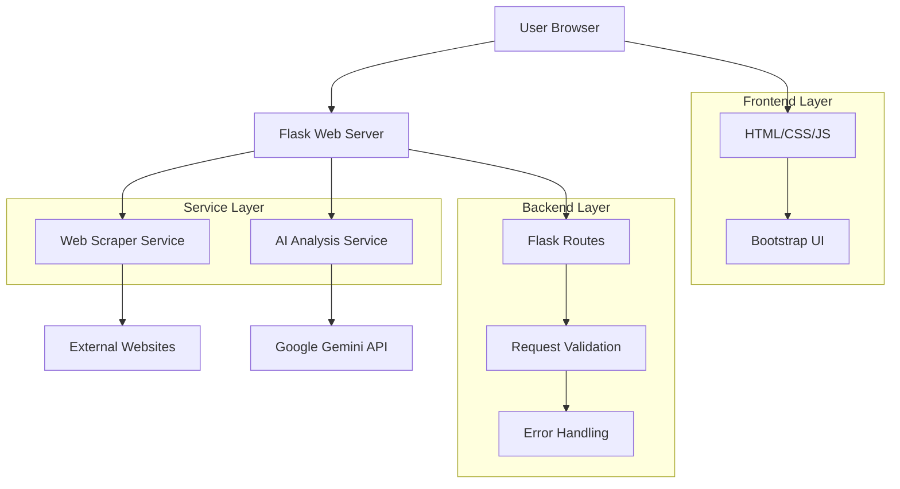

# Design Document

## Overview

QuickBrief AI is designed as a lightweight, single-page web application with a Flask backend that integrates with Google's Gemini AI service. The architecture follows a clean separation of concerns with a responsive frontend, RESTful API backend, and modular service components for web scraping and AI analysis.

The system prioritizes simplicity and reliability, using proven technologies and straightforward patterns to ensure maintainability and ease of deployment.

## Architecture

### High-Level Architecture



### Technology Stack

- **Frontend**: HTML5, CSS3, JavaScript (ES6+), Bootstrap 5
- **Backend**: Python 3.8+, Flask, Flask-CORS
- **Web Scraping**: Requests, BeautifulSoup4
- **AI Integration**: Google Generative AI SDK
- **Development**: Local development server, environment variables for configuration

## Components and Interfaces

### Frontend Components

#### 1. Main Interface (`index.html`)
- **Purpose**: Single-page application interface for user interaction
- **Key Elements**:
  - URL input field with validation
  - Analysis trigger button
  - Loading state indicator
  - Results display area
  - Error message container
- **Responsive Design**: Bootstrap-based layout that works on desktop and mobile devices

#### 2. Styling System (`style.css`)
- **Purpose**: Professional fintech-inspired visual design
- **Key Features**:
  - Color-coded result cards (sentiment, good/bad news, promises, verdict)
  - Clean typography and spacing
  - Loading animations and transitions
  - Accessibility-compliant color contrasts

#### 3. Client-Side Logic (`script.js`)
- **Purpose**: Handle user interactions and API communication
- **Key Functions**:
  - Input validation and sanitization
  - Asynchronous API calls to backend
  - Dynamic result rendering
  - Error state management
  - Loading state control

### Backend Components

#### 1. Flask Application (`app.py`)
- **Purpose**: Main application server and request router
- **Key Routes**:
  - `GET /`: Serve main application page
  - `POST /analyze`: Process analysis requests
- **Configuration**: Environment-based API key management
- **CORS**: Enabled for development flexibility

#### 2. Web Scraper Service
- **Purpose**: Extract text content from provided URLs
- **Implementation**: `scrape_text_from_url()` function
- **Features**:
  - User-agent spoofing for better compatibility
  - Timeout handling (15 seconds)
  - HTML parsing and text extraction
  - Script/style tag removal for clean text
- **Error Handling**: Graceful failure with detailed logging

#### 3. AI Analysis Service
- **Purpose**: Process transcript text through Gemini AI
- **Implementation**: `analyze_text_with_ai()` function
- **Features**:
  - Structured prompt engineering for consistent results
  - JSON response format enforcement
  - Text truncation for API limits (20,000 characters)
  - Model configuration for optimal performance
- **Integration**: Google Generative AI SDK with gemini-1.5-pro-latest model

## Data Models

### Input Data Structure
```python
{
    "url": "string"  # Required, validated URL format
}
```

### AI Analysis Response Structure
```python
{
    "sentiment": "string",        # 1-2 word sentiment summary
    "good_news": ["string"],      # List of 3-5 positive points
    "bad_news": ["string"],       # List of 3-5 negative points  
    "key_promises": ["string"],   # List of 2-4 management commitments
    "verdict": "string"           # Paragraph summary for investors
}
```

### Error Response Structure
```python
{
    "error": "string"  # Human-readable error description
}
```

## Error Handling

### Frontend Error Handling
- **Input Validation**: Client-side URL format validation before submission
- **Network Errors**: Fetch API error catching with user-friendly messages
- **Display Logic**: Error container for showing failure messages
- **Recovery**: Clear error states on new analysis attempts

### Backend Error Handling
- **URL Validation**: Server-side validation of request payload
- **Scraping Failures**: 
  - Network timeouts (15 second limit)
  - HTTP error status codes
  - Invalid response content
- **AI Service Failures**:
  - API key validation on startup
  - Gemini API rate limiting
  - JSON parsing errors from AI responses
- **Logging**: Comprehensive error logging for debugging
- **Response Codes**: Appropriate HTTP status codes (400, 500)

### Graceful Degradation
- **Partial Failures**: Continue operation when non-critical components fail
- **Retry Logic**: Single retry attempt for network operations
- **Fallback Messages**: Informative error messages guide user actions

## Testing Strategy

### Unit Testing Approach
- **Backend Functions**: Test scraping and AI analysis functions in isolation
- **Mock Dependencies**: Mock external APIs (Gemini, web requests) for reliable testing
- **Edge Cases**: Test with various input formats and failure scenarios

### Integration Testing
- **API Endpoints**: Test complete request/response cycles
- **Error Scenarios**: Verify proper error handling and response formats
- **Configuration**: Test with valid/invalid API keys and environment setups

### Manual Testing Protocol
1. **Happy Path Testing**: Use known working transcript URLs
2. **Error Path Testing**: Test with invalid URLs and network failures
3. **UI/UX Testing**: Verify loading states, error displays, and result formatting
4. **Cross-Browser Testing**: Ensure compatibility across modern browsers
5. **Performance Testing**: Verify response times within acceptable limits

### Test Data Sources
- **Valid URLs**: Use publicly available earnings transcripts (e.g., Motley Fool)
- **Invalid URLs**: Test with non-existent domains and malformed URLs
- **Edge Cases**: Test with very short/long content and non-transcript pages

## Security Considerations

### Input Sanitization
- **URL Validation**: Strict URL format validation on both client and server
- **Content Filtering**: Remove potentially harmful scripts from scraped content
- **Request Limits**: Implement reasonable request size and frequency limits

### API Security
- **Environment Variables**: Store sensitive API keys outside of code
- **Key Validation**: Verify API key presence and format on application startup
- **Error Disclosure**: Avoid exposing internal system details in error messages

### Network Security
- **HTTPS**: Recommend HTTPS deployment for production use
- **CORS Configuration**: Properly configure CORS for production domains
- **Timeout Limits**: Prevent resource exhaustion with appropriate timeouts

## Performance Optimization

### Response Time Targets
- **Text Extraction**: < 10 seconds for typical web pages
- **AI Analysis**: < 30 seconds for standard transcript length
- **Total Process**: < 60 seconds end-to-end (per Requirement 1.4)

### Optimization Strategies
- **Text Truncation**: Limit input to Gemini API to prevent timeouts
- **Efficient Parsing**: Use BeautifulSoup4 for fast HTML processing
- **Connection Pooling**: Leverage requests library connection reuse
- **Caching Considerations**: Future enhancement for repeated URL analysis

## Deployment Configuration

### Environment Requirements
- **Python Version**: 3.8+ for compatibility with all dependencies
- **Dependencies**: All packages specified in requirements.txt
- **Environment Variables**: GOOGLE_API_KEY must be configured
- **Port Configuration**: Default Flask development port 5001

### Production Considerations
- **WSGI Server**: Recommend Gunicorn or similar for production deployment
- **Environment Management**: Use proper environment variable management
- **Logging Configuration**: Configure appropriate log levels and destinations
- **Health Checks**: Implement basic health check endpoints for monitoring