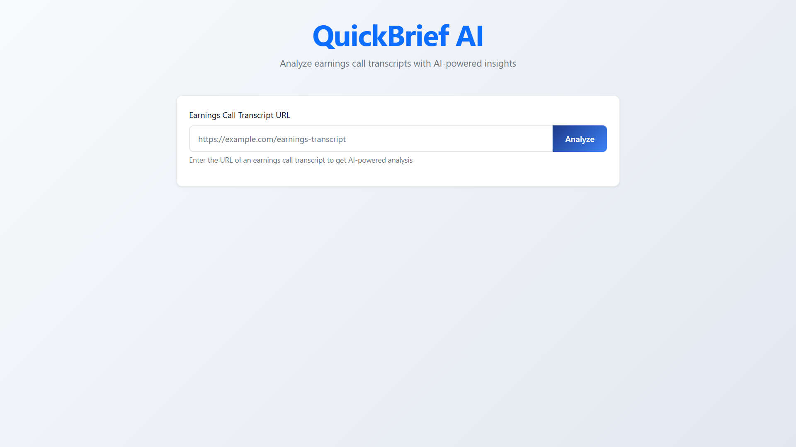
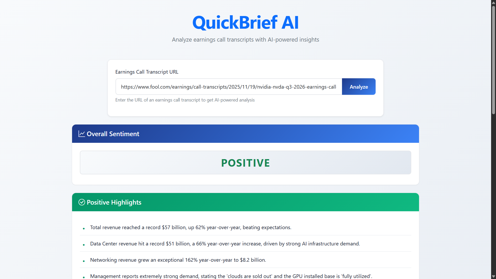
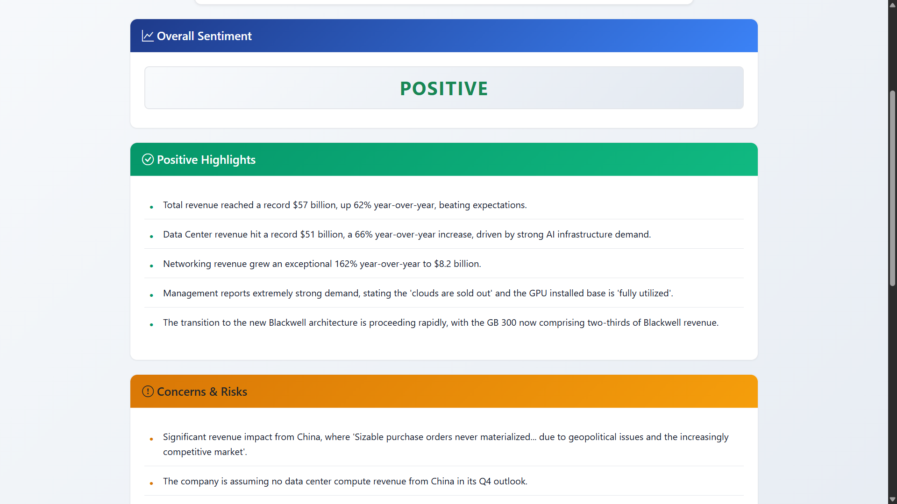
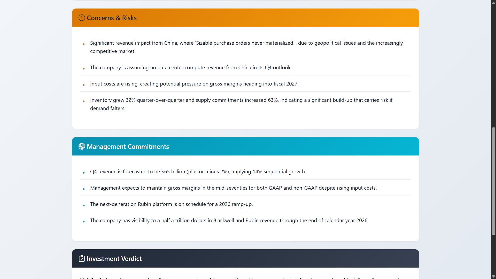
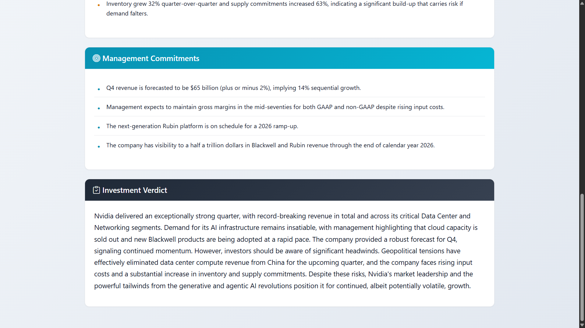

# 📈 QuickBrief AI

<div align="center">


**AI-Powered Earnings Call Transcript Analyzer**

Transform lengthy earnings call transcripts into actionable insights in under 60 seconds using Google Gemini 2.5 Pro

[](https://www.python.org/)
[](https://flask.palletsprojects.com/)
[](https://ai.google.dev/)
[](https://getbootstrap.com/)
[](LICENSE)
[](https://youtu.be/aE24CLFVb7Y)

[Features](#-features) • [Demo](#-demo) • [Quick Start](#-quick-start) • [Documentation](#-documentation) • [License](#-license)

</div>

---

## 🎯 Overview

**QuickBrief AI** is an intelligent web application that leverages Google's Gemini 2.5 Pro AI to analyze earnings call transcripts and provide structured, easy-to-understand summaries for investors. Instead of spending hours reading through 50+ pages of complex financial jargon, get comprehensive analysis in under 60 seconds.

### 💡 The Problem

- Earnings call transcripts are **50-100 pages long**
- Full of **complex financial terminology** and industry jargon
- Take **2-3 hours to read and understand** thoroughly
- Critical insights are **buried in lengthy discussions**
- Difficult to **compare multiple companies** efficiently

### ✨ The Solution

- **AI-Powered Analysis** using Google Gemini 2.5 Pro
- **Structured Summaries** in 5 key categories
- **60-Second Processing** time for instant insights
- **Simple, Actionable Information** for better decisions
- **Professional Interface** with color-coded results

---

## 🚀 Features

### 🤖 Advanced AI Analysis
- **Google Gemini 2.5 Pro** - Latest AI model for superior understanding
- **Structured Output** - Consistent JSON format for reliable results
- **Smart Processing** - Handles transcripts up to 20,000 characters
- **Context-Aware** - Understands financial terminology and nuances

### 📊 Comprehensive Insights

| Category | Description |
|----------|-------------|
| 😊 **Sentiment Analysis** | Overall tone and market outlook |
| ✅ **Positive Highlights** | Key achievements and growth areas |
| ⚠️ **Risk Assessment** | Concerns and challenges identified |
| 🎯 **Management Commitments** | Forward-looking statements and promises |
| 📝 **Investment Verdict** | Actionable summary for decision-making |

### 🎨 Modern User Experience
- **Responsive Design** - Works seamlessly on desktop, tablet, and mobile
- **Real-time Feedback** - Loading indicators and progress updates
- **Color-Coded Results** - Easy visual distinction between categories
- **Fintech-Inspired UI** - Professional and clean interface
- **Smooth Animations** - Polished user interactions

### 🛡️ Robust & Reliable
- **Comprehensive Error Handling** - Graceful failure management
- **Input Validation** - Client and server-side validation
- **Network Resilience** - Timeout handling and retry logic
- **User-Friendly Messages** - Clear error explanations
- **Extensive Testing** - 20+ automated tests with 100% pass rate

---

## 🖼️ Demo

### 🎥 Video Demo

<div align="center">

[](https://youtu.be/aE24CLFVb7Y)

**[▶️ Watch Full Demo on YouTube](https://youtu.be/aE24CLFVb7Y)**

</div>

### 📊 Analysis Results

#### Application Interface



*Clean, intuitive interface for entering transcript URLs*

---

#### AI-Generated Analysis



*Overall Sentiment & Investment Verdict - AI-generated sentiment analysis and comprehensive investment verdict*

---



*Positive Highlights - Key achievements, growth areas, and positive developments*

---



*Concerns & Risks - Potential challenges, risk factors, and areas of concern*

---



*Management Commitments - Forward-looking statements, strategic promises, and future plans*

### 💡 What You Get

Each analysis provides:

| Category | What It Tells You | Why It Matters |
|----------|-------------------|----------------|
| **😊 Sentiment** | Overall tone of the call | Quick gauge of company confidence |
| **✅ Good News** | Achievements & wins | What's working well |
| **⚠️ Bad News** | Challenges & risks | What to watch out for |
| **🎯 Promises** | Future plans | What to expect next |
| **📝 Verdict** | Investment summary | Should you invest? |

---

## ⚡ Quick Start

### Prerequisites

- **Python 3.8+** ([Download](https://www.python.org/downloads/))
- **Google API Key** with Gemini AI access ([Get Free Key](https://makersuite.google.com/app/apikey))
- **Internet Connection** for web scraping and AI analysis

### 🔧 Installation

```bash
# 1. Clone the repository
git clone https://github.com/Anshulmehra001/QuickBrief-AI.git
cd QuickBrief-AI

# 2. Create virtual environment
python -m venv venv

# 3. Activate virtual environment
# Windows:
venv\Scripts\activate
# macOS/Linux:
source venv/bin/activate

# 4. Install dependencies
pip install -r requirements.txt

# 5. Configure API Key
cp .env.example .env
# Edit .env and add your Google API key:
# GOOGLE_API_KEY=your_actual_api_key_here

# 6. Run the application
python app.py

# 7. Open in browser
# Navigate to: http://localhost:5001
```

### 🧪 Quick Test

Try this **NVIDIA Q3 2026 Earnings Call** to test the application:

```
https://www.fool.com/earnings/call-transcripts/2025/11/19/nvidia-nvda-q3-2026-earnings-call-transcript/
```

**Steps:**
1. Open http://localhost:5001 in your browser
2. Paste the URL above into the input field
3. Click the **"Analyze"** button
4. Wait 20-40 seconds for AI processing
5. View your comprehensive analysis!

---

## 📚 Documentation

### 📖 Available Guides

| Document | Description |
|----------|-------------|
| [**Quick Start Guide**](docs/QUICK_START_GUIDE.md) | Detailed setup and installation instructions |
| [**What is This?**](docs/WHAT_IS_THIS.md) | Beginner-friendly explanation of the project |
| [**Sample URLs**](docs/SAMPLE_URLS.md) | 10+ ready-to-test transcript URLs |
| [**Architecture**](docs/architecture.md) | System architecture and technical details |
| [**Submission Summary**](docs/SUBMISSION_SUMMARY.md) | Complete project overview |

### 🔗 Sample Transcript URLs

Test the application with earnings calls from major companies:

**Technology:** NVIDIA, Microsoft, Apple, Amazon, Tesla, Meta  
**Finance:** JPMorgan, Visa  
**Retail:** Starbucks  
**Energy:** Nextracker

👉 **See full list:** [docs/SAMPLE_URLS.md](docs/SAMPLE_URLS.md)

### 🎓 For Beginners

New to earnings calls and financial analysis? Start here:
- 📘 [What are Earnings Call Transcripts?](docs/WHAT_IS_THIS.md#what-are-earnings-call-transcripts)
- 💡 [Why is This Useful?](docs/WHAT_IS_THIS.md#why-is-this-useful)
- 🎯 [Real-World Use Cases](docs/WHAT_IS_THIS.md#example-use-cases)

---

## 🏗️ Architecture

### System Overview

```
┌─────────────────┐
│   User Browser  │
│   (Frontend)    │
└────────┬────────┘
         │ HTTP/HTTPS
         ▼
┌─────────────────┐      ┌──────────────────┐
│  Flask Server   │─────▶│  Web Scraping    │
│   (Backend)     │◀─────│  Service         │
└────────┬────────┘      └────────┬─────────┘
         │                        │
         │                        ▼
         │                ┌──────────────────┐
         │                │ External Website │
         │                │  (Transcripts)   │
         │                └──────────────────┘
         ▼
┌─────────────────┐
│  AI Analysis    │
│  Service        │
└────────┬────────┘
         │
         ▼
┌─────────────────┐
│ Google Gemini   │
│ API (2.5 Pro)   │
└─────────────────┘
```

### 🛠️ Technology Stack

| Layer | Technology | Purpose |
|-------|-----------|---------|
| **Frontend** | HTML5, CSS3, JavaScript | User interface and interactions |
| **UI Framework** | Bootstrap 5.1.3 | Responsive design system |
| **Backend** | Python 3.8+, Flask 2.3.3 | Web server and API |
| **Web Scraping** | Requests 2.31.0, BeautifulSoup4 4.12.2 | Content extraction |
| **AI Engine** | Google Generative AI SDK 0.3.2 | AI integration |
| **AI Model** | Gemini 2.5 Pro | Natural language processing |
| **Configuration** | python-dotenv 1.0.0 | Environment management |
| **CORS** | Flask-CORS 4.0.0 | Cross-origin resource sharing |

📖 **Detailed Architecture:** [docs/architecture.md](docs/architecture.md)

---

## 🧪 Testing

### Automated Test Suite

QuickBrief AI includes comprehensive automated tests:

```bash
# Run all tests
python run_all_tests.py

# Run individual test suites
python test_core_functions.py      # Unit tests
python test_error_scenarios.py     # Error handling tests
python test_real_workflow.py       # Integration tests
python test_workflow.py            # Basic workflow tests
```

### Test Coverage

✅ **20+ Automated Tests**  
✅ **100% Pass Rate**  
✅ **Core Functionality** - Web scraping, AI analysis, API endpoints  
✅ **Error Handling** - Network failures, invalid inputs, API errors  
✅ **Integration** - End-to-end workflow testing  

**Expected Output:**
```
QuickBrief AI - Complete Test Suite
============================================================
✓ Basic Workflow Tests                    PASSED
✓ Realistic Workflow Tests               PASSED
✓ Error Handling Tests                   PASSED
✓ Automated Core Function Tests          PASSED
============================================================
✓ ALL TEST SUITES PASSED!
============================================================
```

---

## 📁 Project Structure

```
QuickBrief-AI/
├── 📱 app.py                          # Main Flask application
├── 📋 requirements.txt                # Python dependencies
├── 🔐 .env.example                    # Environment variable template
├── 📝 README.md                       # This file
├── 📄 LICENSE                         # MIT License
├── 🚫 .gitignore                      # Git exclusions
│
├── 📂 static/                         # Frontend assets
│   ├── 🎨 style.css                   # Application styling
│   └── ⚡ script.js                   # Client-side logic
│
├── 📂 templates/                      # HTML templates
│   └── 🏠 index.html                  # Main application page
│
├── 📂 docs/                           # Documentation
│   ├── 📖 QUICK_START_GUIDE.md        # Setup guide
│   ├── 💡 WHAT_IS_THIS.md             # Beginner's guide
│   ├── 🔗 SAMPLE_URLS.md              # Test URLs
│   ├── 🏗️ architecture.md             # System architecture
│   ├── 📊 SUBMISSION_SUMMARY.md       # Project summary
│   └── 📂 screenshots/                # Application screenshots
│       ├── landing-page.png
│       ├── result-1.png
│       ├── result-2.png
│       ├── result-3.png
│       └── result-4.png
│
└── 📂 tests/                          # Test suites
    ├── test_core_functions.py
    ├── test_error_scenarios.py
    ├── test_real_workflow.py
    ├── test_workflow.py
    └── run_all_tests.py
```

---

## 🔧 Configuration

### Environment Variables

Create a `.env` file in the project root:

```env
# Google Gemini AI API Key
# Get your free key at: https://makersuite.google.com/app/apikey
GOOGLE_API_KEY=your_google_api_key_here
```

### Getting Your API Key

1. Visit [Google AI Studio](https://makersuite.google.com/app/apikey)
2. Sign in with your Google account
3. Click **"Create API Key"**
4. Select or create a Google Cloud project
5. Copy the generated API key
6. Paste it into your `.env` file

### Application Settings

Default configuration in `app.py`:
- **Host:** 0.0.0.0 (all interfaces)
- **Port:** 5001
- **Debug Mode:** Enabled (development only)
- **Scraping Timeout:** 15 seconds
- **AI Text Limit:** 20,000 characters

---

## 🐛 Troubleshooting

<details>
<summary><b>❌ "API key not configured" error</b></summary>

**Solution:**
1. Verify `.env` file exists in project root
2. Check `GOOGLE_API_KEY` is set correctly (no extra spaces)
3. Restart the application after setting the key
4. Test configuration:
   ```bash
   python -c "import os; from dotenv import load_dotenv; load_dotenv(); print('✓ API Key loaded' if os.getenv('GOOGLE_API_KEY') else '✗ API Key missing')"
   ```

</details>

<details>
<summary><b>❌ "Failed to scrape content" error</b></summary>

**Solution:**
1. Verify the URL is accessible in your browser
2. Check your internet connection
3. Try a different transcript URL from [SAMPLE_URLS.md](docs/SAMPLE_URLS.md)
4. Some websites may block automated requests - try another source

</details>

<details>
<summary><b>❌ "Port already in use" error</b></summary>

**Solution:**
1. Stop other applications using port 5001
2. Or change the port in `app.py`:
   ```python
   app.run(debug=True, host='0.0.0.0', port=5002)
   ```

</details>

<details>
<summary><b>❌ Application won't start</b></summary>

**Solution:**
1. Check Python version: `python --version` (requires 3.8+)
2. Verify all dependencies are installed: `pip list`
3. Ensure virtual environment is activated
4. Check terminal for specific error messages

</details>


---

## 🤝 Contributing

Contributions are welcome! Here's how you can help:

### How to Contribute

1. **Fork** the repository
2. **Create** a feature branch (`git checkout -b feature/AmazingFeature`)
3. **Commit** your changes (`git commit -m 'Add some AmazingFeature'`)
4. **Push** to the branch (`git push origin feature/AmazingFeature`)
5. **Open** a Pull Request

### Development Guidelines

- Follow **PEP 8** style guide for Python code
- Add **tests** for new features
- Update **documentation** as needed
- Ensure all **tests pass** before submitting PR
- Write **clear commit messages**

### Code of Conduct

- Be respectful and inclusive
- Provide constructive feedback
- Focus on the code, not the person
- Help others learn and grow

---

## 📝 License

This project is licensed under the **MIT License** - see the [LICENSE](LICENSE) file for details.

**Copyright © 2025 Anshul Mehra**

---

## 🙏 Acknowledgments

- **Google Gemini AI** - For providing the powerful AI model
- **The Motley Fool** - For publicly available earnings transcripts
- **Flask** - For the lightweight and flexible web framework
- **Bootstrap** - For the responsive UI components
- **BeautifulSoup** - For reliable HTML parsing
- **Open Source Community** - For inspiration and support

---

## 📧 Contact & Support

### 👨‍💻 Developer

**Anshul Mehra**
- 🐙 GitHub: [@Anshulmehra001](https://github.com/Anshulmehra001)
- 📦 Repository: [QuickBrief-AI](https://github.com/Anshulmehra001/QuickBrief-AI)

### 🐛 Issues & Bugs

Found a bug or have a feature request?
- 📝 [Open an Issue](https://github.com/Anshulmehra001/QuickBrief-AI/issues)
- 💬 [Start a Discussion](https://github.com/Anshulmehra001/QuickBrief-AI/discussions)

### 💬 Get Help

- 📖 Check the [Documentation](docs/)
- 🔍 Search [Existing Issues](https://github.com/Anshulmehra001/QuickBrief-AI/issues)
- 💡 Read the [Quick Start Guide](docs/QUICK_START_GUIDE.md)

---

## 🌟 Star History

If you find this project useful, please consider giving it a star! ⭐

[](https://star-history.com/#Anshulmehra001/QuickBrief-AI&Date)

---

## 📊 Project Stats


---

## 🚀 Future Enhancements

Potential improvements for future versions:

- [ ] **Caching System** - Store analysis results for repeated URLs
- [ ] **Database Integration** - Persist analysis history
- [ ] **User Accounts** - Save favorite companies and analyses
- [ ] **Batch Processing** - Analyze multiple transcripts simultaneously
- [ ] **Comparison Tool** - Compare multiple quarters or companies
- [ ] **Export Features** - PDF/CSV export of results
- [ ] **RESTful API** - Programmatic access to analysis
- [ ] **Email Alerts** - Notifications for new transcripts
- [ ] **Mobile App** - Native iOS/Android applications
- [ ] **Advanced Analytics** - Trend analysis and predictions

---

<div align="center">

### Made by Anshul Mehra

**If you found this project helpful, please give it a ⭐!**

[⬆ Back to Top](#-quickbrief-ai)

---

**QuickBrief AI** © 2025 | [MIT License](LICENSE) | [Documentation](docs/) | [Issues](https://github.com/Anshulmehra001/QuickBrief-AI/issues)

</div>
